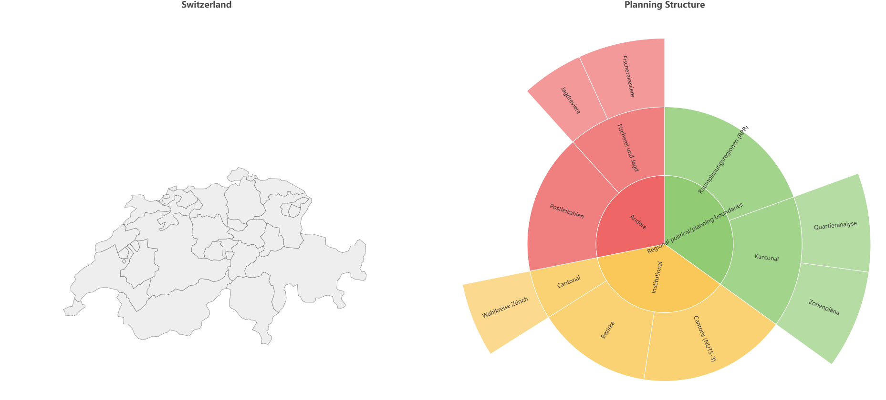
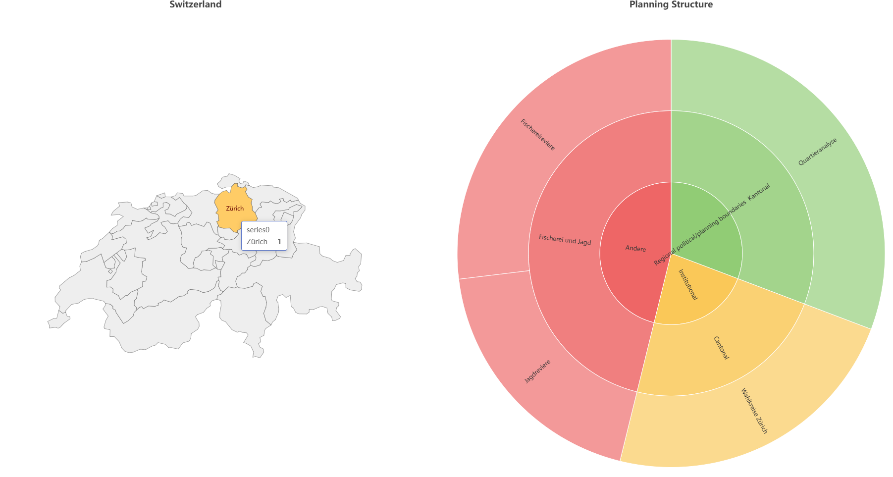
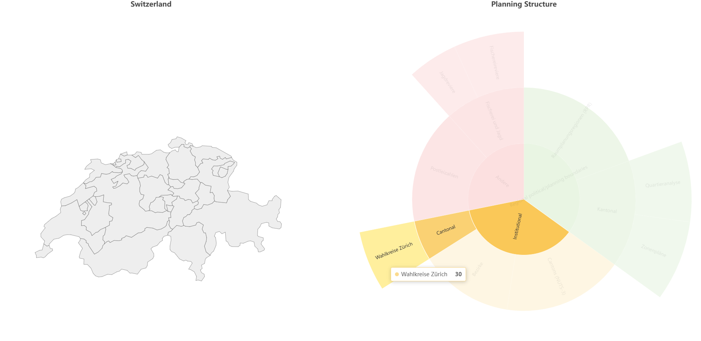
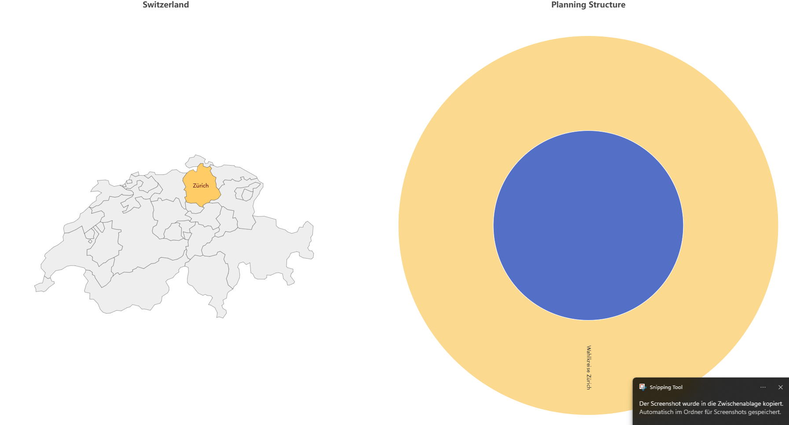

# Use of the open source JavaScript visualisation library [Apache ECharts](https://echarts.apache.org/en/index.html) to make an interactive visualisation

An proposition is that administrativ units are the most known units and my help to order and find units from other thematics. Then, additionnaly to the proposed categorisation of the units by thematic, each unit should have a tag like 'ch', [name of canton], or [name of commune]. The tag should be an attribute of administrativ boundary geometries. 

Here follow some illustrations of what can be tested with ````index_test_apache_echarts.html.```` 

Figure 1 shows the starting point. The entire country and all the units are activated. 

<center>
    
</center>
<br>

Figure 2 shows the filtering of the units for the Zürich canton.

<center>
    
</center>
<br>

Figures 3 and 4 show the highlighting of the canton for a unit (or a category of units).

<center>
    
</center>

<center>
    
</center>
<br>

N.B.:
* Instead of Switzerland, one could chose Zürich and its communes.
* Not all the functionality may work in the current state. 
* Double-clicking resets the map. 
